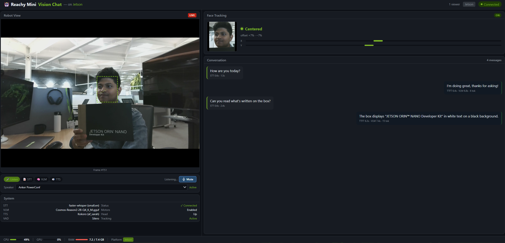

# Reachy Mini Jetson Assistant

<p align="center">
  <a href="https://www.pollen-robotics.com/reachy-mini/"></a>
&nbsp;&nbsp;&nbsp;<b>x</b>&nbsp;&nbsp;&nbsp;
  <a href="https://developer.nvidia.com/embedded/jetson-orin-nano"></a>
</p>

A low-latency, fully on-device voice and vision assistant for [Reachy Mini Lite](https://www.pollen-robotics.com/reachy-mini/) powered by NVIDIA Jetson. Everything runs locally with GPU acceleration — no cloud, no API keys, no internet required at runtime.

> **Default target:** Jetson Orin Nano 8GB on JetPack 7.2 / L4T r39, Python 3.12, CUDA 13.2, and GPU architecture `sm_87`. **Legacy target:** JetPack 6.x / L4T r36 and Python 3.10 remain supported. AGX Orin and Thor support is planned — see [Roadmap](#roadmap).

## What It Does

Speak to Reachy Mini and it responds using a vision-language model that sees through its camera. Reachy tracks and centers the person speaking, then adds expressive head, body, and antenna gestures while it talks. Everything is visible through a browser-based UI with live video, conversation state, and system telemetry.

```
[Mic] → [Silero VAD] → [faster-whisper STT] ──┐
[USB Camera] → [Frame Ring Buffer] ────────────┼→ [VLM stream] → [TTS stream] → [Speaker + Robot]
                                               └→ [Web UI via WebSocket]
```

## Demo

<p align="center">
  
</p>

## Expressive Robot Behavior

The recommended Web Vision Chat mode combines face tracking and speaking gestures through a single 100 Hz motion controller, ensuring that only one component writes motor targets at a time.

### Face Tracking

YuNet-based face tracking gently frames the user with bounded head/body motion, searches when no face is visible, and holds still once the face is good enough for stable VLM capture.

### Speaking Movements

Speaking gestures use curated Pollen Robotics movements, synced with TTS playback and blended with live face tracking so Reachy keeps attending to the user.

Face tracking and speaking movements are configurable under the `reachy` section of `config/settings.yaml`.

## Supported Modes

| Mode | Entry Point | Description |
|------|-------------|-------------|
| **Vision Chat** | `python3 run_vision_chat.py` | Camera + VLM + voice (terminal only) |
| **Web Vision Chat** | `python3 run_web_vision_chat.py` | Same as above + browser UI at `:8090` |
| **Voice Chat** | `python3 run_voice_chat.py` | Text LLM + optional RAG (no camera) |
| **Text Chat** | `python3 main.py chat -t` | Interactive text chat (no mic/speaker) |
| **CLI** | `python3 main.py ask "..."` | Single question, one-shot answer |

## Stack

| Component | Library | Acceleration | Notes |
|-----------|---------|:---:|-------|
| **VLM** | llama.cpp (Docker) | GPU | Gemma 4 E2B GGUF, OpenAI-compatible API |
| **LLM** | llama.cpp (Docker) | GPU | Gemma 3 1B for text-only mode |
| **STT** | faster-whisper | GPU (CUDA) | CTranslate2 with CUDA, small.en default |
| **TTS** | Kokoro ONNX | GPU (CUDA) | Natural voices, subprocess-isolated (see [License Notes](#license-notes)) |
| **VAD** | Silero VAD | CPU | Neural VAD, far better than energy-only |
| **Camera** | OpenCV V4L2 | CPU | Shared latest-frame buffer, configurable resolution/FPS |
| **Robot** | Reachy Mini SDK + Pollen recorded moves | USB | 100 Hz layered motion, 15 Hz face tracking, expressive TTS gestures |
| **RAG** | ChromaDB + llama.cpp | GPU | bge-small-en-v1.5 embeddings (voice chat only) |
| **Web UI** | FastAPI + WebSocket | CPU | Live video, conversation stream, system stats |

## Prerequisites

- **NVIDIA Jetson Orin Nano** (8GB) with JetPack 7.2 / L4T 39.2.0, CUDA 13.2, and Python 3.12 for the default path
- **Docker with the NVIDIA container runtime** for the llama.cpp VLM server
- **Internet access during setup and first model download**; inference is local afterward
- **[Reachy Mini Lite](https://huggingface.co/docs/reachy_mini/platforms/reachy_mini_lite/get_started)** connected via USB (optional for the software-only benchmark)
- **NVMe SSD** recommended for swap and model storage

## Setup

### JetPack 7.2 (default)

Clone the repository and run the non-mutating compatibility check:

```bash
git clone https://github.com/NVIDIA-AI-IOT/reachy-mini-jetson-assistant.git
cd reachy-mini-jetson-assistant
./scripts/setup_jetson.sh --check-only
```

The script selects one exact compatibility tuple from `packaging/jetson-wheels.json`, installs the system and Python dependencies, downloads only the matching CTranslate2 and ONNX Runtime GPU wheels, verifies their size, SHA-256, metadata, and platform tags, and checks both CUDA backends. Unsupported combinations fail with an error; there is no generic ARM CPU fallback.

Install the exact published JetPack 7.2 wheel set with:

```bash
./scripts/setup_jetson.sh
```

The current JP7.2 wheel set is published as a GitHub prerelease. Its local technical audit passes, but the organization-approved scanner report and final OSRB closure evidence are not included, so it must not be represented as a final or generally available release. Maintainers can still validate replacement candidate wheels from a local directory:

```bash
./scripts/setup_jetson.sh --wheel-dir /absolute/path/to/wheelhouse
```

The prerelease’s [release evidence bundle](packaging/releases/native-jp72-cu132-py312-sm87-r1/README.md) contains the wheel inventory, SPDX SBOM, exact source revisions and patch, build environment, license archive, and release gate status. The evidence keeps the missing organization-approved NVIDIA license/security scan visible instead of implying that publication completed OSRB review.

The manifest entry is marked `published: true`, so the no-argument command is the normal installation path for the exact supported tuple. See the **[JetPack 7.2 setup guide](docs/JETPACK_7_2_SETUP.md)** for platform checks, replacement-candidate testing, connected-Reachy bring-up, and source-build fallbacks.

### JetPack 6 (legacy, retained)

JetPack 6.x / L4T r36 and Python 3.10 remain supported through the repository's previous installation flow. Follow the complete **[JetPack 6 setup guide](SETUP.md)**, then select `config/settings.jp6.yaml` and the documented r36/CUDA 12.6 llama.cpp image. Do not run `setup_jetson.sh` on JetPack 6; it intentionally rejects platforms without an exact manifest entry.

The base `config/settings.yaml` and `run_llama_cpp.sh` defaults target JetPack 7.2. Silero VAD uses the model bundled with faster-whisper, so the JP7.2 path does not require PyTorch, torchaudio, or a separate `silero-vad` installation.

### Runtime policy

Native CTranslate2 STT and ONNX Runtime Kokoro TTS are the supported default. The setup script verifies GPU execution and stops rather than silently falling back to portable ARM CPU packages. Speaches remains useful as an optional, separately managed compatibility or comparison service, but this application does not install it or automatically route STT/TTS through it.

## Usage

### Quick Start (Vision Chat with Web UI)

This is the recommended mode — VLM + camera + voice + browser dashboard:

**Terminal 1** — Start the VLM server:

```bash
NP=1 ./run_llama_cpp.sh unsloth/gemma-4-E2B-it-GGUF:Q4_K_M
```

On Orin Nano 8GB, multimodal models automatically use a 1024-token context and `BATCH=128 UBATCH=128`. These bounds keep enough CUDA-visible memory available for faster-whisper and Kokoro while splitting image tokens into valid chunks. Override the environment variables for larger-memory Jetsons or text-only models. The model container uses Docker's `unless-stopped` restart policy by default; set `RESTART=no` to disable it.

Wait until you see `llama server listening at http://0.0.0.0:8080`.

**Terminal 2** — Start the assistant:

```bash
source .venv/bin/activate
python3 run_web_vision_chat.py
```

Open `http://<jetson-ip>:8090` in a browser to see the live UI with camera feed, conversation log, and system stats. The robot listens through its microphone and responds via VLM + TTS.

Press **Ctrl+C** once to exit cleanly (robot will go to sleep position).

### Vision Chat (Terminal Only)

Same pipeline without the web UI:

```bash
NP=1 ./run_llama_cpp.sh unsloth/gemma-4-E2B-it-GGUF:Q4_K_M
# In another terminal:
source .venv/bin/activate
python3 run_vision_chat.py
```

### Voice Chat (Text LLM, No Camera)

For text-only conversations with optional RAG:

```bash
./run_llama_cpp.sh ggml-org/gemma-3-1b-it-GGUF:Q8_0
# For RAG, also start the embedding server:
./run_llama_embedding.sh ggml-org/bge-small-en-v1.5-Q8_0-GGUF:Q8_0

# In another terminal:
source .venv/bin/activate
python3 run_voice_chat.py           # with RAG
python3 run_voice_chat.py --no-rag  # without RAG
```

### CLI Commands

```bash
python3 main.py chat -t                        # interactive text chat
python3 main.py ask "What is the Jetson Orin?"  # single question
python3 main.py info                            # system info
python3 main.py rag-status                      # RAG index status
python3 main.py rag-search "GPU specs"          # search the knowledge base
```

### Test Robot Movement

```bash
python3 scripts/test_reachy_movement.py
```

### Stopping

```bash
# Stop the LLM/VLM Docker container:
docker stop assistant-llm

# Stop the embedding server (if running):
docker stop assistant-embed
```

## Web UI

The web UI (`run_web_vision_chat.py`) provides a real-time dashboard accessible from any browser on the same network:

- **Live camera feed** from the shared camera buffer, including face-detection and tracking state, with VLM capture using the latest stable frame
- **Conversation log** with streaming VLM responses
- **Push-to-talk** button (starts muted, click to unmute)
- **System stats** — CPU, GPU, RAM usage
- **Config panel** — displays active settings
- **Platform detection** — shows the specific Jetson model

Access at `http://<jetson-ip>:8090`. The web UI adds minimal overhead (~5 MB RAM).

## Configuration

`config/settings.yaml` is the JetPack 7.2 default. Optional YAML overlays are merged on top of it through `REACHY_ASSISTANT_CONFIG`:

```bash
export REACHY_ASSISTANT_CONFIG=config/settings.jp72-no-reachy.yaml  # software benchmark
export REACHY_ASSISTANT_CONFIG=config/settings.jp72-reachy.yaml     # conservative robot bring-up
export REACHY_ASSISTANT_CONFIG=config/settings.jp6.yaml             # legacy JetPack 6
```

Unset the variable to return to the normal JetPack 7.2 connected-Reachy configuration. Edit the base file to tune shared behavior:

| Section | What It Controls |
|---------|-----------------|
| `llm` | LLM server URL, model, temperature, max tokens, system prompts |
| `stt` | Whisper model size, CUDA device, beam size |
| `tts` | Voice, speed, language, chunking |
| `audio` | Sample rate, input device |
| `vad` | Silero threshold, silence duration, utterance filters |
| `vision` | Camera resolution, capture FPS, frames per query, VLM system prompt, few-shot examples |
| `reachy` | Robot connection, daemon behavior, horizontal/vertical tracking, scan/reacquisition, capture settling, and speaking movements |
| `web` | UI FPS, host, port |
| `rag` | Embedding backend, knowledge directory, retrieval settings |

For developers adding new config fields, see `app/config.py` — typed dataclasses define schema defaults, the base YAML overrides those defaults, and the selected profile overrides only the fields it contains.

## Project Structure

```
reachy-mini-jetson-assistant/
├── .agents/skills/           # Setup, deploy, and debug agent skills
├── app/
│   ├── pipeline.py          # Audio I/O, VAD, TTS streaming, mic recording
│   ├── config.py            # Configuration dataclasses + YAML loader
│   ├── llm.py               # LLM/VLM client (OpenAI-compatible, multimodal)
│   ├── stt.py               # faster-whisper speech-to-text
│   ├── tts.py               # TTS client (spawns subprocess worker)
│   ├── tts_worker.py        # TTS subprocess (Kokoro + GPL deps, isolated)
│   ├── camera.py            # USB webcam ring buffer (OpenCV, V4L2)
│   ├── face_detector.py     # YuNet face detection (OpenCV CPU)
│   ├── face_tracker.py      # 15 Hz horizontal/vertical visual tracking
│   ├── movement_manager.py  # Single-writer 100 Hz layered motion controller
│   ├── speaking_movements.py # Curated official Pollen TTS gestures
│   ├── vision_capture.py    # Stable-frame acquisition and motion settling
│   ├── reachy.py            # Reachy Mini connection, daemon management
│   ├── web.py               # FastAPI + WebSocket server for browser UI
│   ├── monitor.py           # System resource monitoring (CPU/GPU/RAM)
│   ├── rag.py               # ChromaDB + embeddings retrieval
│   ├── audio.py             # PulseAudio / ALSA device helpers
│   └── cli.py               # Typer CLI (chat, ask, rag-*)
├── config/
│   ├── settings.yaml        # JetPack 7.2 default configuration
│   ├── settings.jp6.yaml    # Legacy JetPack 6 overlay
│   ├── settings.jp72-reachy.yaml    # Conservative hardware bring-up
│   └── settings.jp72-no-reachy.yaml # Software-only benchmark
├── docs/
│   └── JETPACK_7_2_SETUP.md # Default JP7.2 wheel/source-build guide
├── patches/
│   └── onnxruntime-v1.28.0-jp72.patch
├── packaging/
│   └── jetson-wheels.json # Exact wheel compatibility/checksum manifest
├── static/
│   └── index.html           # Web UI (single-file HTML/CSS/JS)
├── scripts/
│   ├── setup_jetson.sh    # Detect, install, and validate a supported Jetson
│   ├── install_jp72_gpu_wheels.sh # Validate/install JP7.2 CUDA wheels
│   ├── bench_ttft.py        # VLM TTFT benchmark
│   ├── bench_mocked_voice_pipeline.py # Software-only latency benchmark
│   ├── test_reachy_movement.py   # Robot movement test
│   └── test_vlm_prompts.py  # VLM prompt experiments
├── knowledge_base/          # Markdown docs for RAG
├── models/                  # Local GGUF models (gitignored)
├── voices/                  # TTS voice files (gitignored)
├── run_web_vision_chat.py   # Vision chat + web UI (recommended)
├── run_vision_chat.py       # Vision chat (terminal only)
├── run_voice_chat.py        # Voice chat with optional RAG
├── run_llama_cpp.sh         # Docker LLM/VLM server launcher
├── run_llama_embedding.sh   # Docker embedding server launcher
├── main.py                  # CLI entry point
└── requirements.txt         # Python dependencies
```

## Performance Notes (Orin Nano 8GB)

JetPack 7.2 software-only measurements used CUDA `float16` faster-whisper, a GPU llama.cpp text model, and Kokoro on `CUDAExecutionProvider`. Median warm latencies over three runs were:

| Stage | JP7.2 median |
|-------|-------------:|
| Silero VAD compute | 26 ms |
| STT | 444 ms |
| LLM time to first token | 206 ms |
| TTS compute | 595 ms |
| First audio ready | 1.07 s |
| Pipeline complete | 1.34 s |

Those numbers exclude real microphone capture, camera/VLM prefill, speaker playback, and robot motion. A connected-Reachy human-spoken turn validated the USB motor controller, camera, GPU STT/VLM/TTS, Reachy speaker playback, and an official speaking gesture with Gemma 4 E2B Q4_K_M. That turn measured 0.5 s STT, 1.8 s VLM TTFT, and 2.1 s total VLM time. Ten consecutive live-camera VLM requests then completed in 1.52-1.76 s each with the bounded VLM batch defaults.

Vision encoder prefill is the primary bottleneck on Orin Nano. Flash attention is enabled in `run_llama_cpp.sh`; llama.cpp automatically disables cache reuse when it is unsupported by the selected multimodal model. The launcher disables hidden reasoning by default so the short response budget is returned as speakable `content`, and sets llama.cpp's prompt-cache RAM limit to zero to preserve memory for CUDA STT and TTS. Advanced users can override these safeguards with `REASONING` and `CACHE_RAM`.

## Development and Validation

This project was developed and validated on the [NVIDIA Jetson platform](https://developer.nvidia.com/embedded-computing) with assistance from [Jetson Device Skills](https://github.com/NVIDIA-AI-IOT/jetson-device-skills), a collection of foundational agent skills for working with Jetson devices.

Jetson Device Skills supported hardware inspection, [JetPack](https://developer.nvidia.com/embedded/jetpack) and CUDA environment validation, dependency verification, performance diagnostics, and device-level troubleshooting during development and bring-up.

Jetson Device Skills are development and validation tools only. They are not packaged with this application and are not required to install or run the Reachy Mini assistant.

The repository also includes three focused project skills under `.agents/skills`: `reachy-jetson-setup`, `reachy-jetson-deploy`, and `reachy-jetson-debug`. They give compatible coding agents the same fail-closed setup, safe launch, and evidence-first troubleshooting workflows used for this application.

## Roadmap

- [x] Orin Nano 8GB — JP7.2 GPU pipeline and controlled Reachy output path validated
- [x] Human-spoken microphone → Silero VAD → GPU STT/VLM/TTS hardware turn on JP7.2
- [x] Web UI with live camera, conversation log, push-to-talk
- [x] Kokoro TTS GPU acceleration
- [x] Silero VAD for robust speech detection
- [x] KV cache reuse + flash attention for faster VLM TTFT
- [x] 15 Hz horizontal and vertical face tracking with bounded search and reacquisition
- [x] TTS-synchronized head, body, and antenna movements from the official Pollen library
- [ ] **AGX Orin** — larger models (Cosmos-Reason2-7B, Gemma 3 4B), higher resolution, multi-turn context
- [ ] **Thor** — real-time VLM, multi-camera, extended context windows
- [ ] Multi-turn conversation memory
- [ ] Multi-language support

Contributions for AGX Orin and Thor testing are welcome.

## Troubleshooting

See the default [JetPack 7.2 setup guide](docs/JETPACK_7_2_SETUP.md) for JP7.2 bring-up. JetPack 6 users should use the [legacy troubleshooting guide](SETUP.md#troubleshooting).

## Reachy Mini Resources

| Resource | Link |
|----------|------|
| Getting Started | [huggingface.co/docs/reachy_mini](https://huggingface.co/docs/reachy_mini/index) |
| Reachy Mini Lite Setup | [Lite Guide](https://huggingface.co/docs/reachy_mini/platforms/reachy_mini_lite/get_started) |
| Python SDK Docs | [SDK Reference](https://huggingface.co/docs/reachy_mini/SDK/readme) |
| Quickstart | [First Behavior](https://huggingface.co/docs/reachy_mini/SDK/quickstart) |
| AI Integrations | [LLMs, Apps, HF Spaces](https://huggingface.co/docs/reachy_mini/SDK/integration) |
| Core Concepts | [Architecture & Coordinates](https://huggingface.co/docs/reachy_mini/SDK/core-concept) |
| Code Examples | [github.com/pollen-robotics/reachy_mini/examples](https://github.com/pollen-robotics/reachy_mini/tree/main/examples) |
| Community Apps | [Hugging Face Spaces](https://hf.co/reachy-mini/#/apps) |
| Discord | [Join the Community](https://discord.gg/Y7FgMqHsub) |
| Troubleshooting | [FAQ Guide](https://huggingface.co/docs/reachy_mini/troubleshooting) |

## License Notes

This project uses [Kokoro ONNX](https://github.com/thewh1teagle/kokoro-onnx) for text-to-speech. Kokoro ONNX itself is MIT-licensed, but it depends on:

- **phonemizer-fork** — GPL-3.0 (text-to-phoneme conversion)
- **espeak-ng** — GPL-3.0 (speech synthesis library loaded by `espeakng-loader`)

TTS runs in a separate subprocess (`app/tts_worker.py`); the main application communicates with it through JSON over stdin/stdout. That boundary is useful for component isolation, but is not by itself a legal conclusion about a combined distribution. Distributors must complete their own OSRB review and meet the applicable GPL notice and corresponding-source obligations.

See [THIRD-PARTY-NOTICES.md](THIRD-PARTY-NOTICES.md) for the dependency and native-wheel license inventory, [NOTICE](NOTICE) for project attribution, and the [OSRB release checklist](docs/OSRB_RELEASE_CHECKLIST.md) for release-gate status.

## Contributing

We welcome community contributions. Please see [CONTRIBUTING.md](CONTRIBUTING.md) for guidelines, including the Developer Certificate of Origin (DCO) sign-off requirement.

## License

Apache 2.0 — see [LICENSE](LICENSE) for details.
